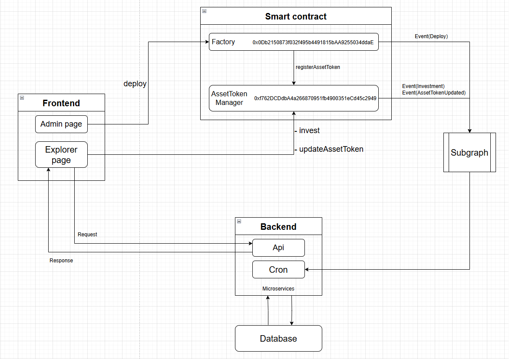
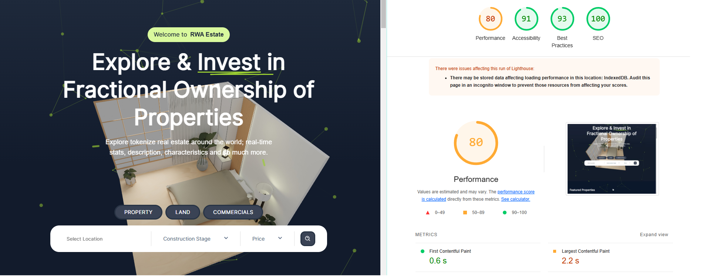

<a name="readme-top"></a>

<!-- PROJECT LOGO -->....
<br />
<div align="center">
  <a href="/">
    
  </a>
  <h1 align="center">Compute Labs Fullstack 
Engineer Take Home Challenge</h1>
<div style="display: flex; align-items: center; justify-content: center; gap: 5px">
    
    
</div>
</div>

<!-- PROJECT DESCRIPTION -->
<details>
  <ol>
    <li>
      <a href="#project-overview">Project Overview</a>
      <ul>
        <li><a href="#project-workflow">Project Workflows</a></li>
        <li><a href="#recommended-tech-stack">Recommended Tech Stack</a></li>
        <li><a href="#core-features-and-requirements">Core Features and Requirements</a></li>
        <li><a href="#api-details">API Details</a></li>
        <li><a href="#bonus-features">Bonus Features</a></li>
      </ul>
    </li>
    <li>
      <a href="#getting-started">Setup and Installation instrcutions</a>
      <ul>
        <li><a href="#dependencies">Dependencies</a></li>
        <li><a href="#backend">Backend</a></li>
        <li><a href="#frontend">Frontend</a></li>
      </ul>
    </li>
  </ol>
</details>

<!-- ABOUT THE PROJECT -->

## Project Overview

Design and implement the frontend for a crowdfunding platform for real estate
projects. The platform should allow users to browse and invest in fractional
ownership of properties, track their investments, and participate in project
governance. While the backend and blockchain integration can be mocked (big
bonus if you can actually implement!), the focus should be on creating a high
quality, performant, and user-friendly frontend experience.

<!----PROJECT WORK FLOW----->

### Project workflow

<a href="http://164.92.81.155">
    
</a>

<!----Recommended Tech Stacks--->

### Recommended Tech Stack

| Frontend     | Implementation Status |
| ------------ | --------------------- |
| Next.js      | ✅                    |
| Typescript   | ✅                    |
| Tailwind CSS | ✅                    |
| GSAP         | ✅                    |
| MUI          | ✅                    |

| State Management | Implementation Status |
| ---------------- | --------------------- |
| React Query      | ❌                    |
| Zustand          | ❌                    |
| Redux            | ✅                    |

| UI Components           | Implementation Status                                                                   |
| ----------------------- | --------------------------------------------------------------------------------------- |
| Radix UI                | ❌                                                                                      |
| Headless UI             | ❌                                                                                      |
| Your Preferred Solution | <strong style="color: green"> Used Custom UI components based on Figma design </strong> |

| Testing                 | Implementation Status                                                                       |
| ----------------------- | ------------------------------------------------------------------------------------------- |
| Jest                    | ❌                                                                                          |
| React Testing Library   | ❌                                                                                          |
| Your Preferred Solution | <strong style="color: green"> Tried to test all functionalities mannually on local</strong> |

| Performance Monitoring | Implementation Status |
| ---------------------- | --------------------- |
| Lighthouse             | ✅                    |
| Web Vitals             | ❌                    |

<a href="">
    
</a>

<!------CORE FEATURES---->

### Core features and Requirements

| Features                                   | Implementation Status                     | Detail                                                                     |
| ------------------------------------------ | ----------------------------------------- | -------------------------------------------------------------------------- |
| User Authentication and Profile Management | ✅ (Wallet Authentication (dApp pattern)) | Wagmi Library                                                              |
| Property Listing and Details               | ✅ frontend, backend, smart contract      | Store Images using IPFS (pinata), Smart Contract Integrated Backend System |
| Investment Simulation                      | ✅ Only frontend                          | Implement locally                                                          |
| Dashboard for Tracking Investments         | ✅ frontend, backend, smart contract      | Works well on both Frontend and Backend (MongoDB)                          |

<!----API DETAILS--->

### API Details

<a href="https://abc-72.gitbook.io/crowdfund" >
    API Overview
</a>

<!---BONUS FEATURES-->

### Bonus Features

| Bonus Features                                                        | Implementation Status | Details                                                  |
| --------------------------------------------------------------------- | --------------------- | -------------------------------------------------------- |
| Admin Panel for Property Management                                   | ✅                    | frontend, backend, smart contract                        |
| Implement a dark/light mode toggle                                    | ✅                    |
| Implement Animations                                                  | ✅                    | GSAP                                                     |
| Implement Smart Contracts Using Solidity                              | ✅                    | Wrote Smart Contract for Etheruem Blockchain Integration |
| Integrate with Web3.js or Ethers.js for blockchain interactions       | ✅                    |
| Implement wallet connection                                           | ✅                    | (Metamask, TrustWallet, etc.)                            |
| Create functions for minting property tokens and handling investments | ✅                    | Wrote Smart Contract for Etheruem Blockchain Integration |
| Governance and Voting System UI                                       | ❌                    |
| Solana Integration                                                    | ❌                    |
| Add real-time updates using WebSockets or Server-Sent Events          | ❌                    |
| Implement multi-language support                                      | ✅                    |
| Create an interactive property exploration feature                    | ❌                    |
| Implement advanced filtering and sorting options for property         | ✅                    |

<!-- GETTING STARTED -->

## Getting Started

### Dependencies

- [NodeJS][node] v14 or greater
- [npm][npm] v6 or greater

To verify things are set up
properly, you can run this:

```shell
node --version
npm --version
```

If you have trouble with any of these, learn more about the PATH environment variable and how to fix it.

### Installation

```js
npm install
```

### Backend

Backend is built based on Microservices Design Architecture and there are two different services such as `api` and `cron`.
So you should run those services simultaneously on different ports (`api: 80`, `cron:3001` in our case) if you are using single server.
To run the backend successfully, you need to install `redis` and `pm2` on your platform (Windows or MacOS or Linux).

#### Linux

Install `redis` on Ubuntu server

```shell
sudo apt update
sudo apt install redis-server
sudo systemctl start redis
sudo systemctl enable redis
```

#### MacOS

Install `redis` using Homebrew

```shell
/bin/bash -c "$(curl -fsSL https://raw.githubusercontent.com/Homebrew/install/HEAD/install.sh)"
```

```shell
brew install redis
brew services start redis
```

- Run `dev` server

1. Clone the repository
2. `cd` to Project root
3. `npm install` and `npm run dev`

- Run `prod` server

1. Clone the repository
2. `cd` to Project root
3. `npm install` and `npm run build`
4. Copy paste `.env` to `dist` folder `cp .env ./dist/`
5. Copy paste `ecosystem.yml` to `dist` folder `cp ecosystem.yml ./dist`
6. Run the server using `pm2` : `pm2 start ecosystem.yml`

### Frontend

Frontend is built with the modern Next.js version. You know the latest Next.js version is using App router rather than page routuer of the deprecated Next.js versions.
I tried to implement all required functionalities and available bonus features.
I will describe more details in the meeting.

- Run Frontend

1. Clone the repository
2. `cd` to Project
3. Install node modules: `npm install`
4. Ensure the `.env` file.

```js
BASE_URL=http://{server url}
```

5. Run `dev` server: `npm run dev` (3000 port)

- Frontend Architecture

```plaintext
src/                                      # Source files
│
├── config/                               # Store config files
│   ├── chart.ts
│   ├── gsap.ts
│   ├── i18n.ts
│   ├── particles.ts
│   ├── themeConfig.ts
│   ├── web3.ts
│   └── index.ts
│
├── api                                   # Define APIs for Backend
│   └── index.ts
│
├── types                                 # Define all types
│   └── index.ts
│
├── pages                                 # Define main pages
│   ├── explore                           # Define explore page
│   │   ├── [id]
│   │   └── index.tsx
│   ├── profile                           # Define profile page
│   │   ├── edit
│   │   └── index.tsx
│   ├── simulation                        # Define simulation page
│   │   └── index.tsx
│   ├── _app.tsx                          # Add all providers
│   ├── 403.tsx                           # Define 403 page
│   ├── 404.tsx                           # Define 404 page
│   └── index.tsx                         # Define main page
│
├── views                                 # Define sections for each page
│   ├── landing                           # Define sections of landing page
│   │   ├── landing.tsx
│   │   ├── feature.tsx
│   │   ├── faq.tsx
│   │   ├── newlist.tsx
│   │   ├── price.tsx
│   │   └── property.tsx
│   ├── explore                           # Define sections of explore page
│   │   ├── about.tsx
│   │   ├── calculator.tsx
│   │   └── issuer.tsx
│   ├── simulation                        # Define sections of simulation page
│   │   ├── chartoption.tsx
│   │   ├── filteroption.tsx
│   │   ├── investgraph.tsx
│   │   └── notification.tsx
│   ├── profile                           # Define sections of profile page
│   │   ├── chart.tsx
│   │   ├── profilecard.tsx
│   │   ├── propertyfilter.tsx
│   │   └── staticcard.tsx
│   └── component                         # All functional components
│       ├── Card
│       ├── LandingForm
│       └── PropertyCard
│
├── layouts                               # Layout
│   ├── Header.tsx                        # Header
│   ├── Footer.tsx                        # Footer
│   └── index.tsx
│
├── store                                 # State Management with Redux
│   ├── reducers
│   │   ├── auth.ts
│   │   ├── setting.ts
│   │   └── index.ts
│   └── index.ts
│
├── utils                                 # Define all utility functions
│   └── helper.ts
│
├── context                               # Define all context
│   ├── LoadingContext.tsx
│   └── Web3Context.tsx
│
└── @core                                 # Define basic components
    ├── auth
    ├── button
    ├── fileInput
    ├── gallery
    ├── google-map
    ├── modal
    ├── pagination
    ├── spinner
    ├── translation
    └── option-menu

```
